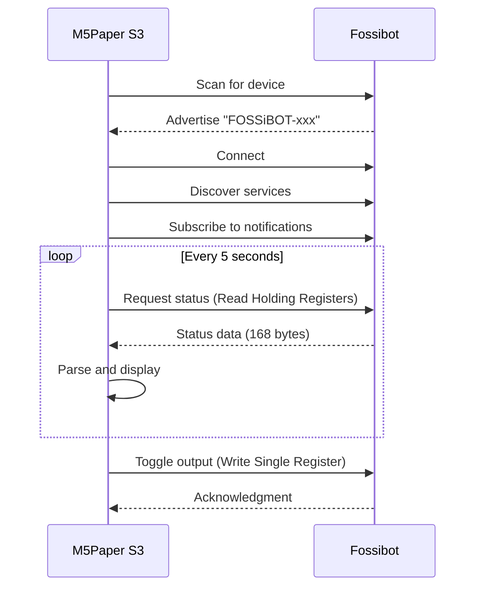
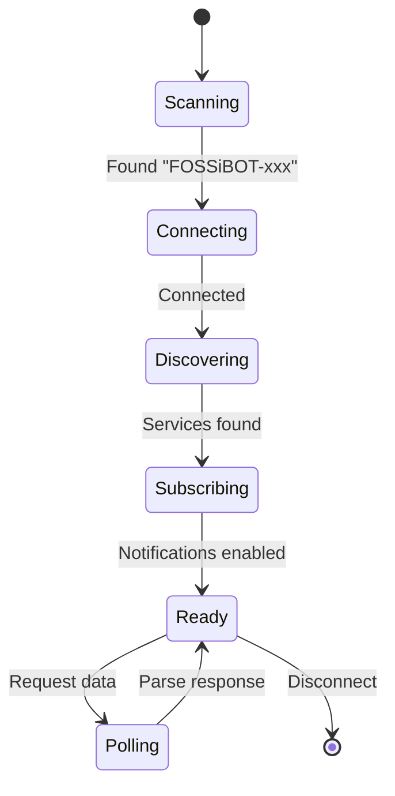

# Fossibot BLE Protocol Guide

This guide documents the Bluetooth Low Energy (BLE) communication protocol used to communicate with Fossibot power stations.

## Overview

Fossibot power stations communicate via BLE using a Modbus-like protocol over custom GATT characteristics.



## BLE Service and Characteristics

### Service UUID

```
0000ffe0-0000-1000-8000-00805f9b34fb
```

### Characteristics

| UUID | Name | Properties | Description |
|------|------|------------|-------------|
| `0000ffe1-0000-1000-8000-00805f9b34fb` | Data | Read, Write, Notify | Main data channel |
| `0000ffe2-0000-1000-8000-00805f9b34fb` | Control | Write | Command channel |

## Modbus Protocol

The Fossibot uses a modified Modbus RTU protocol over BLE.

### Command Format

All commands follow this structure:

| Byte | Field | Description |
|------|-------|-------------|
| 0 | Device Address | Always `0x11` (17) |
| 1 | Function Code | `0x03` (Read) or `0x06` (Write) |
| 2-3 | Register Address | Big-endian 16-bit |
| 4-5 | Value/Count | Big-endian 16-bit |
| 6-7 | CRC-16 | CRC-16 Modbus (see below) |

### Function Codes

| Code | Name | Description |
|------|------|-------------|
| `0x03` | Read Holding Registers | Read multiple registers |
| `0x06` | Write Single Register | Write one register |

## CRC-16 Modbus Calculation

The CRC is calculated using the Modbus polynomial `0xA001`.

### Algorithm

```cpp
uint16_t calculateCRC(uint8_t* data, size_t length) {
    uint16_t crc = 0xFFFF;
    
    for (size_t i = 0; i < length; i++) {
        crc ^= data[i];
        for (int j = 0; j < 8; j++) {
            if (crc & 1) {
                crc = (crc >> 1) ^ 0xA001;
            } else {
                crc >>= 1;
            }
        }
    }
    
    return crc;
}
```

### CRC Byte Order

> ⚠️ **Important:** The Fossibot expects CRC bytes in **high-byte first** order, which is opposite to standard Modbus RTU.

```cpp
// Correct byte order for Fossibot
command[6] = (crc >> 8) & 0xFF;  // High byte first
command[7] = crc & 0xFF;         // Low byte second
```

### Example: Read Status Command

**Command:** Read 80 registers starting from address 0

```
Payload: [0x11, 0x03, 0x00, 0x00, 0x00, 0x50]
          │     │     │     │     │     │
          │     │     │     │     └─────┴── Count: 80 registers
          │     │     └─────┴────────────── Start Address: 0
          │     └────────────────────────── Function: Read Holding Registers
          └──────────────────────────────── Device Address: 17

CRC Calculation:
  Input: 11 03 00 00 00 50
  CRC:   0xC5A2
  
Full Command: [0x11, 0x03, 0x00, 0x00, 0x00, 0x50, 0xC5, 0xA2]
```

### Example: Toggle USB Output

**Command:** Write 1 to register 24 (enable USB)

```
Payload: [0x11, 0x06, 0x00, 0x18, 0x00, 0x01]
          │     │     │     │     │     │
          │     │     │     │     └─────┴── Value: 1 (enable)
          │     │     └─────┴────────────── Register: 24 (USB output)
          │     └────────────────────────── Function: Write Single Register
          └──────────────────────────────── Device Address: 17

CRC Calculation:
  Input: 11 06 00 18 00 01
  CRC:   0x09CA
  
Full Command: [0x11, 0x06, 0x00, 0x18, 0x00, 0x01, 0x09, 0xCA]
```

## Register Map

### Status Registers (Read)

These registers are read using function code `0x03`.

| Register | Offset | Name | Description | Unit |
|----------|--------|------|-------------|------|
| 3 | 6 | AC Input Power | AC charging power | W |
| 4 | 8 | DC Input Power | Solar/DC input | W |
| 6 | 12 | Total Input Power | Sum of all inputs | W |
| 20 | 40 | Total System Power | Including internal | W |
| 22 | 44 | Battery Voltage | ÷ 100 for volts | V×100 |
| 39 | 78 | Output Power | Active output | W |
| 41 | 82 | Active Outputs | Bitmask (see below) | - |
| 56 | 112 | State of Charge | ÷ 10 for percent | %×10 |
| 58 | 116 | Time to Full | When charging | minutes |
| 59 | 118 | Time to Empty | When discharging | minutes |

### Active Outputs Bitmask (Register 41)

| Bit | Value | Output |
|-----|-------|--------|
| 9 | 512 | USB |
| 10 | 1024 | DC (12V) |
| 11 | 2048 | AC (Inverter) |

**Example:**

```cpp
uint16_t states = getRegValue(41);
bool usbActive = (states & 512) != 0;   // Bit 9
bool dcActive = (states & 1024) != 0;   // Bit 10
bool acActive = (states & 2048) != 0;   // Bit 11
```

### Control Registers (Write)

These registers are written using function code `0x06`.

| Register | Name | Values | Description |
|----------|------|--------|-------------|
| 24 | USB Output | 0=Off, 1=On | Toggle USB ports |
| 25 | DC Output | 0=Off, 1=On | Toggle 12V DC |
| 26 | AC Output | 0=Off, 1=On | Toggle inverter |
| 56 | Key Sound | 0=Off, 1=On | Button beep |
| 57 | Silent Charging | 0=Off, 1=On | Quiet mode |
| 66 | Discharge Limit | %×10 | Lower SOC limit |
| 67 | Charge Limit | %×10 | Target charge % |

## Response Parsing

### Status Response Format

The status response is 168 bytes:

| Bytes | Field | Description |
|-------|-------|-------------|
| 0-2 | Header | `[0x11, 0x03, 0xA0]` |
| 3-5 | Unknown | - |
| 6-165 | Registers | 80 × 2-byte values (big-endian) |
| 166-167 | CRC | CRC-16 Modbus |

### Extracting Register Values

```cpp
auto getRegValue = [data, length](uint16_t regIndex) -> uint16_t {
    uint16_t offset = 6 + (regIndex * 2);  // Skip 6-byte header
    if (offset + 1 >= length) return 0;
    return (data[offset] << 8) | data[offset + 1];  // Big-endian
};

// Examples
float batteryPercent = getRegValue(56) / 10.0f;  // 560 -> 56.0%
float inputPower = getRegValue(6);                // Direct watts
float batteryVoltage = getRegValue(22) / 100.0f; // 4900 -> 49.00V
```

## Implementation Example

### Complete Toggle Function

```cpp
void toggleUSB(bool currentState) {
    uint8_t reg = 24;  // USB register
    uint16_t value = currentState ? 0 : 1;  // Toggle
    
    // Build payload
    uint8_t payload[6] = {
        0x11,                    // Device address
        0x06,                    // Function: Write Single Register
        0x00,                    // Register high byte
        reg,                     // Register low byte
        (uint8_t)(value >> 8),   // Value high byte
        (uint8_t)(value & 0xFF)  // Value low byte
    };
    
    // Calculate CRC
    uint16_t crc = 0xFFFF;
    for (int i = 0; i < 6; i++) {
        crc ^= payload[i];
        for (int j = 0; j < 8; j++) {
            if (crc & 1) crc = (crc >> 1) ^ 0xA001;
            else crc >>= 1;
        }
    }
    
    // Build command with CRC (high byte first!)
    uint8_t command[8];
    memcpy(command, payload, 6);
    command[6] = (crc >> 8) & 0xFF;  // High byte first
    command[7] = crc & 0xFF;
    
    // Send via BLE
    writeCharacteristic->writeValue(command, 8, false);
}
```

## Connection Flow



## Debugging Tips

1. **Enable Serial Logging:**

   ```cpp
   Serial.printf("BLE: Sent command reg=%d value=%d (CRC=0x%04X)\n", 
                 reg, value, crc);
   ```

2. **Verify CRC Byte Order:**
   - If commands are ignored, check CRC byte order
   - Fossibot expects high byte first

3. **Check Response Length:**
   - Status response should be 168 bytes
   - Shorter responses may indicate communication issues

## See Also

- [Hardware Guide](hardware-guide.md) - I2C and peripheral details
- [UI Architecture](ui-architecture.md) - How data is displayed
- [Known Issues](known-issues.md) - Protocol quirks and workarounds
