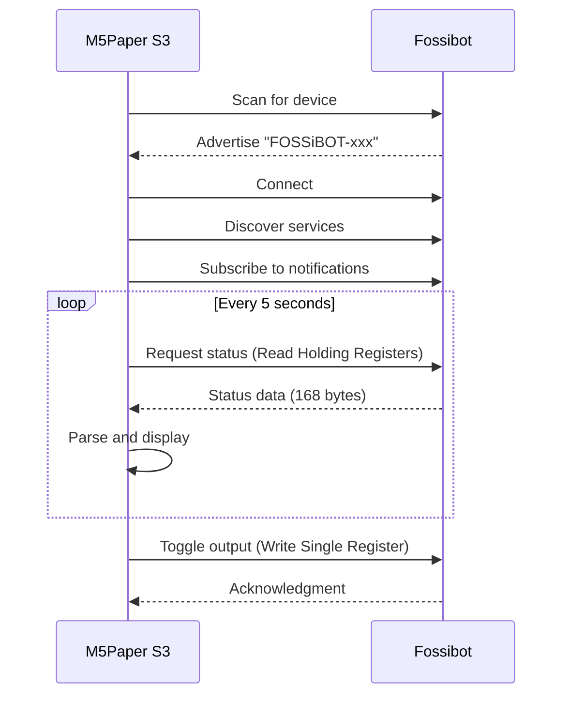
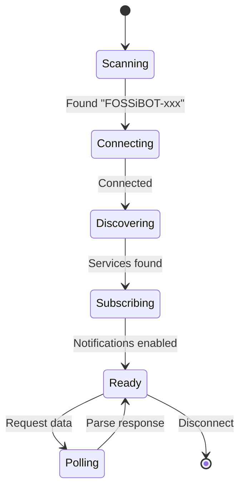

# Fossibot BLE Protocol Guide

This guide documents the Bluetooth Low Energy (BLE) communication protocol used to communicate with Fossibot power stations.

## Overview

Fossibot power stations communicate via BLE using a Modbus-like protocol over custom GATT characteristics.


```mermaid
sequenceDiagram
    participant M5 as M5Paper S3
    participant FB as Fossibot
    
    M5->>FB: Scan for device
    FB-->>M5: Advertise "FOSSiBOT-xxx"
    M5->>FB: Connect
    M5->>FB: Discover services
    M5->>FB: Subscribe to notifications
    loop Every 5 seconds
        M5->>FB: Request status (Read Holding Registers)
        FB-->>M5: Status data (168 bytes)
        M5->>M5: Parse and display
    end
    M5->>FB: Toggle output (Write Single Register)
    FB-->>M5: Acknowledgment
```

## BLE Service and Characteristics

### Service UUID

```
0000ffe0-0000-1000-8000-00805f9b34fb
```

### Characteristics

| UUID | Name | Properties | Description |
|------|------|------------|-------------|
| `0000ffe1-0000-1000-8000-00805f9b34fb` | Data | Read, Write, Notify | Main data channel |
| `0000ffe2-0000-1000-8000-00805f9b34fb` | Control | Write | Command channel |

## Modbus Protocol

The Fossibot uses a modified Modbus RTU protocol over BLE.

### Command Format

All commands follow this structure:

| Byte | Field | Description |
|------|-------|-------------|
| 0 | Device Address | Always `0x11` (17) |
| 1 | Function Code | `0x03` (Read) or `0x06` (Write) |
| 2-3 | Register Address | Big-endian 16-bit |
| 4-5 | Value/Count | Big-endian 16-bit |
| 6-7 | CRC-16 | CRC-16 Modbus (see below) |

### Function Codes

| Code | Name | Description |
|------|------|-------------|
| `0x03` | Read Holding Registers | Read multiple registers |
| `0x06` | Write Single Register | Write one register |

## CRC-16 Modbus Calculation

The CRC is calculated using the Modbus polynomial `0xA001`.

### Algorithm

```cpp
uint16_t calculateCRC(uint8_t* data, size_t length) {
    uint16_t crc = 0xFFFF;
    
    for (size_t i = 0; i < length; i++) {
        crc ^= data[i];
        for (int j = 0; j < 8; j++) {
            if (crc & 1) {
                crc = (crc >> 1) ^ 0xA001;
            } else {
                crc >>= 1;
            }
        }
    }
    
    return crc;
}
```

### CRC Byte Order

> ⚠️ **Important:** The Fossibot expects CRC bytes in **high-byte first** order, which is opposite to standard Modbus RTU.

```cpp
// Correct byte order for Fossibot
command[6] = (crc >> 8) & 0xFF;  // High byte first
command[7] = crc & 0xFF;         // Low byte second
```

### Example: Read Status Command

**Command:** Read 80 registers starting from address 0

```
Payload: [0x11, 0x03, 0x00, 0x00, 0x00, 0x50]
          │     │     │     │     │     │
          │     │     │     │     └─────┴── Count: 80 registers
          │     │     └─────┴────────────── Start Address: 0
          │     └────────────────────────── Function: Read Holding Registers
          └──────────────────────────────── Device Address: 17

CRC Calculation:
  Input: 11 03 00 00 00 50
  CRC:   0xC5A2
  
Full Command: [0x11, 0x03, 0x00, 0x00, 0x00, 0x50, 0xC5, 0xA2]
```

### Example: Toggle USB Output

**Command:** Write 1 to register 24 (enable USB)

```
Payload: [0x11, 0x06, 0x00, 0x18, 0x00, 0x01]
          │     │     │     │     │     │
          │     │     │     │     └─────┴── Value: 1 (enable)
          │     │     └─────┴────────────── Register: 24 (USB output)
          │     └────────────────────────── Function: Write Single Register
          └──────────────────────────────── Device Address: 17

CRC Calculation:
  Input: 11 06 00 18 00 01
  CRC:   0x09CA
  
Full Command: [0x11, 0x06, 0x00, 0x18, 0x00, 0x01, 0x09, 0xCA]
```

## Register Map

### Input Registers (Read via OpCode 0x1104)

These registers are read using function code `0x04`.

| Reg | Offset | Name | Description | Unit |
|-----|--------|------|-------------|------|
| 2 | 4 | AC Charge Speed | AC charge speed status | 1-5 |
| 3 | 6 | AC Input Power | AC charging power | W |
| 4 | 8 | DC Input Power | Solar/DC input | W |
| 6 | 12 | Total Input Power | Sum of AC + DC inputs | W |
| 8 | 16 | Error Code | 0=OK, 78=Inverter, 79=Safety Lockout | code |
| 18 | 36 | AC Output Voltage | AC output voltage | V×10 |
| 19 | 38 | AC Output Frequency | AC output frequency | Hz×10 |
| 20 | 40 | Total Output Watts | Sum of all outputs | W |
| 21 | 42 | Bus Voltage | **Multiplexed**: charging=AC input V×10, discharging=DC bus V | V |
| 22 | 44 | Battery Voltage | ÷ 100 for volts | V×100 |
| 30 | 60 | USB-A1 Watts | USB-A port 1 power | W×10 |
| 31 | 62 | USB-A2 Watts | USB-A port 2 power | W×10 |
| 39 | 78 | Output Power | Active output | W |
| 41 | 82 | Active Port Flags | Bitmask for USB/DC/AC icons | bitmask |
| 42 | 84 | Protection Flags | **Bitmask** (see fault detection below) | bitmask |
| 47 | 94 | Protocol Version | Always 12288 | - |
| 48 | 96 | System Status | 0x8000=Charging, 0x4000=Standby, 0x0008=Error | bitmask |
| 52 | 104 | Model Constant | 180=Fossibot, 0=Aferiy (**NOT temperature**) | - |
| 54 | 108 | Battery Full Capacity | Full battery capacity | Ah×10 |
| 56 | 112 | State of Charge | ÷ 10 for percent | %×10 |
| 58 | 116 | Time to Full | When charging | minutes |
| 59 | 118 | Time to Empty | When discharging | minutes |

### Active Port Flags Bitmask (Register 41)

| Bit | Value | Output |
|-----|-------|--------|
| 9 | 512 | USB |
| 10 | 1024 | DC (12V) |
| 11 | 2048 | AC (Inverter) |

```cpp
uint16_t states = getRegValue(41);
bool usbActive = (states & 512) != 0;   // Bit 9
bool dcActive = (states & 1024) != 0;   // Bit 10
bool acActive = (states & 2048) != 0;   // Bit 11
```

### Protection Flags Bitmask (Register 42)

> **CRITICAL:** Register 42 is "Hardware GPIO & Fault Mask". It mixes status bits with fault bits. You **cannot** check `if (Reg42 > 0)` — you **must** use a bitmask!

| Bits | Mask | Name | Description |
|------|------|------|-------------|
| 0-12 | 0x1FFF | MOSFET Status | Output MOSFET status (e.g., ~984 when USB/DC on) |
| 13-14 | 0x6000 | **Critical Fault** | Hardware failure bits |
| 15 | 0x8000 | Warning Latch | Non-critical, often always on |

```cpp
// Correct fault detection:
const bool isCriticalFault = (Reg42 & 0x6000) > 0;

// WRONG - will false-trigger on normal MOSFET status bits:
// const bool isFault = (Reg42 > 0);  // DO NOT USE
```

### Error Code Logic (Register 8)

| Code | Name | Description |
|------|------|-------------|
| 0 | Normal | No error |
| 78 | Inverter Fault | AC output failed; DC charging via solar still works |
| 79 | Safety Lockout | AC charging interrupted |

**Error 79 classification depends on Register 42:**
- If `(Reg42 & 0x6000) > 0`: **Hardware Failure** — display "DEVICE ERROR"
- If `(Reg42 & 0x6000) == 0`: **Environmental Protection** (Cold/Hot Temp) — display "TEMP/SAFETY PROTECTION"

### System Status Flags (Register 48)

| Bit | Mask | Name |
|-----|------|------|
| 15 | 0x8000 | AC Charging active |
| 14 | 0x4000 | Inverter Standby/Ready |
| 3 | 0x0008 | Error Pending |

**Status Text Priority:** Error (bit 3) > Charging (bit 15) > Standby (bit 14)

### Holding Registers (Read via OpCode 0x1103 / Write via 0x06)

| Reg | Name | Values | Description |
|-----|------|--------|-------------|
| 5 | Master Enable | 0=Off, 1=On | Master system enable |
| 11 | Hardware ID | 1536=US, 512=EU | Device model identification |
| 13 | AC Charge Speed | 1-5 | AC charge speed setpoint |
| 14 | Max Charge Wattage | 1500=US, 1100=EU | Maximum charge power |
| 19 | Max AC Input Current | 1600=US, 500=EU | Maximum AC input |
| 24 | USB Output | 0=Off, 1=On | Toggle USB ports |
| 25 | DC Output | 0=Off, 1=On | Toggle 12V DC |
| 26 | AC Output | 0=Off, 1=On | Toggle inverter |
| 27 | Light Mode | 0-3 | off/on/flash/sos |
| 56 | Key Sound | 0=Off, 1=On | Button beep |
| 57 | Silent Charging | 0=Off, 1=On | Quiet mode |
| 66 | Discharge Limit | %×10 | Lower SOC limit |
| 67 | Charge Limit | %×10 | Target charge % |

## Response Parsing

### Status Response Format

The status response is 168 bytes:

| Bytes | Field | Description |
|-------|-------|-------------|
| 0-2 | Header | `[0x11, 0x03, 0xA0]` |
| 3-5 | Unknown | - |
| 6-165 | Registers | 80 × 2-byte values (big-endian) |
| 166-167 | CRC | CRC-16 Modbus |

### Extracting Register Values

```cpp
auto getRegValue = [data, length](uint16_t regIndex) -> uint16_t {
    uint16_t offset = 6 + (regIndex * 2);  // Skip 6-byte header
    if (offset + 1 >= length) return 0;
    return (data[offset] << 8) | data[offset + 1];  // Big-endian
};

// Examples
float batteryPercent = getRegValue(56) / 10.0f;  // 560 -> 56.0%
float inputPower = getRegValue(6);                // Direct watts
float batteryVoltage = getRegValue(22) / 100.0f; // 4900 -> 49.00V
```

## Implementation Example

### Complete Toggle Function

```cpp
void toggleUSB(bool currentState) {
    uint8_t reg = 24;  // USB register
    uint16_t value = currentState ? 0 : 1;  // Toggle
    
    // Build payload
    uint8_t payload[6] = {
        0x11,                    // Device address
        0x06,                    // Function: Write Single Register
        0x00,                    // Register high byte
        reg,                     // Register low byte
        (uint8_t)(value >> 8),   // Value high byte
        (uint8_t)(value & 0xFF)  // Value low byte
    };
    
    // Calculate CRC
    uint16_t crc = 0xFFFF;
    for (int i = 0; i < 6; i++) {
        crc ^= payload[i];
        for (int j = 0; j < 8; j++) {
            if (crc & 1) crc = (crc >> 1) ^ 0xA001;
            else crc >>= 1;
        }
    }
    
    // Build command with CRC (high byte first!)
    uint8_t command[8];
    memcpy(command, payload, 6);
    command[6] = (crc >> 8) & 0xFF;  // High byte first
    command[7] = crc & 0xFF;
    
    // Send via BLE
    writeCharacteristic->writeValue(command, 8, false);
}
```

## Connection Flow


```mermaid
stateDiagram-v2
    [*] --> Scanning
    Scanning --> Connecting: Found "FOSSiBOT-xxx"
    Connecting --> Discovering: Connected
    Discovering --> Subscribing: Services found
    Subscribing --> Ready: Notifications enabled
    Ready --> Polling: Request data
    Polling --> Ready: Parse response
    Ready --> [*]: Disconnect
```

## Debugging Tips

1. **Enable Serial Logging:**

   ```cpp
   Serial.printf("BLE: Sent command reg=%d value=%d (CRC=0x%04X)\n", 
                 reg, value, crc);
   ```

2. **Verify CRC Byte Order:**
   - If commands are ignored, check CRC byte order
   - Fossibot expects high byte first

3. **Check Response Length:**
   - Status response should be 168 bytes
   - Shorter responses may indicate communication issues

## SwitchBot Bot (power-on path)

Powering the station off is a Modbus write to holding register 64, but there is
no matching power-on register: a Fossibot that is off has its BLE radio off too,
so nothing can reach it over the air. The way back in is a SwitchBot Bot - a
servo-driven button pusher - stuck over the physical power button.

This is a completely separate BLE peripheral from the Fossibot, with its own
service, and it speaks nothing like Modbus. Implemented in
`src/ble/switchbot_client.cpp`.

### Service and characteristics

Identical on every SwitchBot device:

| UUID | Role |
|---|---|
| `cba20d00-224d-11e6-9fb8-0002a5d5c51b` | Communication service |
| `cba20002-224d-11e6-9fb8-0002a5d5c51b` | Write (commands go here) |
| `cba20003-224d-11e6-9fb8-0002a5d5c51b` | Notify (result comes back here) |

### Request format

Every request opens with the magic byte `0x57`. Byte 1 packs three fields:
bits 7:6 protocol version, bits 5:4 encryption mode, bits 3:0 command. Command
`0x01` is "execute action"; the action byte follows.

| Bytes | Meaning |
|---|---|
| `57 01 00` | Press (push and retract) - the one we send |
| `57 01 01` | Turn on (hold down), latch mode |
| `57 01 02` | Turn off (release), latch mode |
| `57 02` | Get device info (battery, firmware, mode) |

If the Bot has a password set in the SwitchBot app, encryption mode 1 applies
and the CRC32 of the password is carried in the command:

```
57 11 <crc32 big-endian, 4 bytes> 00
```

Only the CRC32 is stored on the device, never the password itself. The CRC is
standard IEEE 802.3 (reflected, polynomial `0xEDB88320`).

### Response codes

First byte of the notification:

| Code | Meaning |
|---|---|
| `0x01` | Success (a press answers `01 FF 00`) |
| `0x02` | Bot reported an error |
| `0x03` | Bot busy - retry shortly |
| `0x06` | Bot battery too low to actuate |
| `0x07` | Password required |
| `0x09` | Wrong password |

Some firmware revisions never notify at all. A write that was accepted almost
certainly actuated, so that case is reported as "no reply" rather than failure.

### Implementation notes

- Addressed by MAC (`switchbot_mac` in `settings.json`), so no scan is needed.
  Note the web PWA cannot do this - Web Bluetooth hides MACs and must show a
  device chooser instead.
- The press is queued by the touch handler and executed from `update()`: a
  connect can block for seconds and touch handlers must stay responsive. Same
  reasoning as `FossibotBLE::requestReconnectNow()`.
- Connect, write, disconnect. The link is not held open; in practice the
  Fossibot link is down anyway whenever this is needed.
- NimBLE is a singleton shared with the Fossibot client, so the press path
  initialises it only if the user has powered the radio down in Settings.
- Same two guards the Fossibot connect path needs: boost the CPU off 80MHz eco
  mode, and `waitDisplay()` before starting the radio.

### Reference

- [SwitchBot official BLE API](https://github.com/OpenWonderLabs/SwitchBotAPI-BLE) - `devicetypes/bot.md`
- [pySwitchbot](https://github.com/Danielhiversen/pySwitchbot) - password/CRC32 variant
- [node-switchbot](https://github.com/OpenWonderLabs/node-switchbot)

## See Also

- [Hardware Guide](hardware-guide.md) - I2C and peripheral details
- [UI Architecture](ui-architecture.md) - How data is displayed
- [Known Issues](known-issues.md) - Protocol quirks and workarounds
