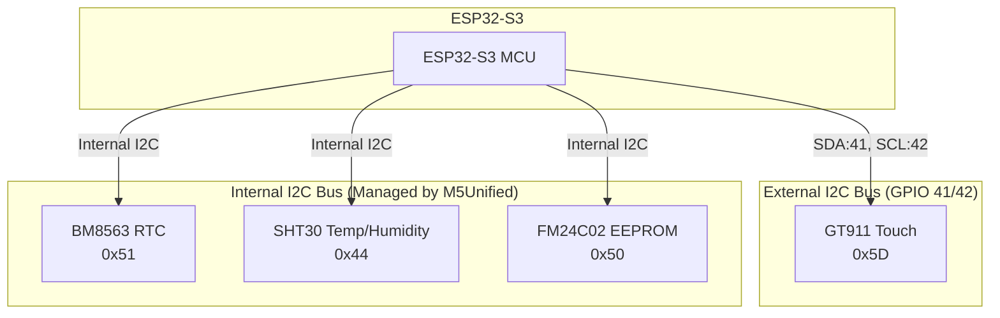
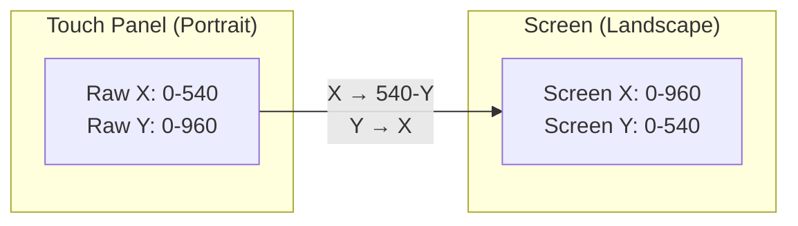

# M5Paper S3 Hardware Guide

This guide covers the hardware architecture of the M5Paper S3 and how it interfaces with peripherals in this project.

## M5Paper S3 Specifications

| Feature | Specification |
|---------|---------------|
| MCU | ESP32-S3 (dual-core, 240MHz) |
| Flash | 16MB |
| PSRAM | 8MB |
| Display | 4.7" E-Ink (540×960 pixels) |
| Touch | GT911 Capacitive Touch Controller |
| RTC | BM8563 Real-Time Clock |
| Battery | 1150mAh LiPo |
| Connectivity | WiFi, Bluetooth 5.0 |

## I2C Bus Architecture

The M5Paper S3 has multiple I2C buses for different peripherals:



### I2C Addresses

| Device | Address | Bus | Purpose |
|--------|---------|-----|---------|
| GT911 | 0x5D | External (GPIO 41/42) | Touch controller |
| BM8563 | 0x51 | Internal | Real-time clock |
| SHT30 | 0x44 | Internal | Temperature/humidity sensor |
| FM24C02 | 0x50 | Internal | EEPROM storage |

## Pin Mapping

### Touch Panel (GT911)

| Signal | GPIO | Description |
|--------|------|-------------|
| SDA | 41 | I2C Data |
| SCL | 42 | I2C Clock |
| INT | 36 | Interrupt (not used in polling mode) |

### E-Ink Display (IT8951)

The E-Ink display uses SPI communication managed internally by M5GFX.

| Signal | GPIO | Description |
|--------|------|-------------|
| CS | 4 | Chip Select |
| DC | 15 | Data/Command |
| RST | 21 | Reset |
| BUSY | 22 | Busy signal |

### Power Management

| Signal | GPIO | Description |
|--------|------|-------------|
| BAT_ADC | 35 | Battery voltage ADC |
| PWR_HOLD | 2 | Power hold |
| EXT_PWR | 5 | External power control |

## I2C Initialization

### The Wire Configuration Challenge

M5Unified initializes the internal I2C bus automatically for the RTC and other internal peripherals. However, the GT911 touch controller is on a different I2C bus (GPIO 41/42).

**Current Implementation:**

```cpp
// After M5.begin(), reconfigure Wire for GT911 touch
Wire.end();
delay(10);
Wire.begin(41, 42);  // SDA, SCL for GT911
```

> ⚠️ **Important:** This reconfiguration breaks communication with the internal I2C devices (RTC, SHT30, etc.) because it moves Wire to the external bus. See [Known Issues](known-issues.md) for the workaround.

### GT911 Touch Controller

The GT911 is a capacitive touch controller that reports touch coordinates via I2C.

**Register Map (Key Registers):**

| Register | Address | Description |
|----------|---------|-------------|
| Product ID | 0x8140 | "911" ASCII |
| Status | 0x814E | Touch status (bit 7 = touched, bits 0-2 = point count) |
| Point 1 X | 0x8150-0x8151 | X coordinate (16-bit little-endian) |
| Point 1 Y | 0x8152-0x8153 | Y coordinate (16-bit little-endian) |

**Touch Reading Sequence:**

```cpp
// 1. Read status register
Wire.beginTransmission(0x5D);
Wire.write(0x81);
Wire.write(0x4E);
Wire.endTransmission();
Wire.requestFrom(0x5D, 1);
uint8_t status = Wire.read();

// 2. If touched (bit 7 set and point count > 0)
if ((status & 0x80) && (status & 0x07) > 0) {
    // Read point 1 data
    Wire.beginTransmission(0x5D);
    Wire.write(0x81);
    Wire.write(0x50);
    Wire.endTransmission();
    Wire.requestFrom(0x5D, 4);
    // Parse X and Y coordinates...
}

// 3. Clear status register
Wire.beginTransmission(0x5D);
Wire.write(0x81);
Wire.write(0x4E);
Wire.write(0x00);
Wire.endTransmission();
```

### Coordinate Transformation

The GT911 reports coordinates in the touch panel's native orientation (540×960 portrait). The display is used in landscape mode (960×540), so coordinates must be transformed:

```cpp
// Touch panel: 540x960 (Portrait)
// Display: 960x540 (Landscape)

int screen_x = raw_y;           // Panel Y -> Screen X
int screen_y = 540 - raw_x;     // Invert Panel X -> Screen Y
```



## BM8563 Real-Time Clock

The BM8563 is an I2C-based RTC with battery backup.

| Feature | Specification |
|---------|---------------|
| Address | 0x51 |
| Interface | I2C |
| Backup | Coin cell battery |
| Accuracy | ±5 ppm |

**M5Unified API:**

```cpp
// Read time
auto dt = M5.Rtc.getDateTime();
int year = dt.date.year;
int month = dt.date.month;
int day = dt.date.date;
int hour = dt.time.hours;
int minute = dt.time.minutes;

// Write time
m5::rtc_datetime_t dt;
dt.date.year = 2026;
dt.date.month = 1;
dt.date.date = 9;
dt.time.hours = 11;
dt.time.minutes = 30;
dt.time.seconds = 0;
M5.Rtc.setDateTime(dt);
```

> ⚠️ **Note:** Due to the I2C bus conflict (see above), the RTC is not accessible in this project. A software-based time solution is used instead.

## Power Management

### Battery Monitoring

The M5Paper S3 has a built-in battery with voltage monitoring:

```cpp
int level = M5.Power.getBatteryLevel();  // Returns 0-100%
```

> ⚠️ **Note:** This may return -2% if the power management driver isn't properly configured for M5Paper S3.

### External Power Control

The external 5V power can be controlled:

```cpp
M5.Power.setExtOutput(true);  // Enable external 5V
```

This is useful for powering external peripherals during initialization.

## Display Characteristics

### E-Ink Refresh

E-Ink displays have unique characteristics:

| Property | Value |
|----------|-------|
| Full refresh time | ~1-2 seconds |
| Partial refresh | Faster but may ghost |
| Ghosting | Residual images from previous content |

**Best Practices:**

- Minimize refresh frequency (5+ seconds recommended)
- Use high contrast (black on white)
- Periodic full refresh to clear ghosting

### Display Commands

```cpp
// Clear display
M5.Display.fillScreen(TFT_WHITE);

// Draw text
M5.Display.setTextColor(TFT_BLACK);
M5.Display.setTextSize(3);
M5.Display.setCursor(100, 100);
M5.Display.print("Hello");

// Force display update (E-Ink)
M5.Display.display();
```

## See Also

- [BLE Protocol](ble-protocol.md) - Fossibot communication
- [UI Architecture](ui-architecture.md) - Screen and touch handling
- [Known Issues](known-issues.md) - Limitations and workarounds
