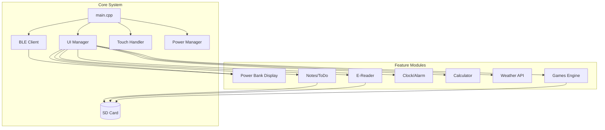

# M5Paper S3 Multi-Feature Power Bank Display & Smart Assistant

## Overview

A comprehensive ESP32-S3 project for the M5Paper S3 device (960x540, 4.7" eInk) that connects to a Fossibot power bank via Bluetooth and provides multiple utility features including brain training games, e-reader, clock, calculator, notes, and weather dashboard.

---

## Hardware Specifications

| Component | Details |
|-----------|---------|
| **MCU** | ESP32-S3R8 Dual-Core @ 240MHz |
| **Display** | 4.7" eInk, 960x540, 16 grayscale, 235 PPI |
| **Touch** | GT911 capacitive, 2-point touch + gestures |
| **Memory** | 8MB PSRAM, 16MB Flash |
| **Storage** | MicroSD card slot (primary storage for all data) |
| **Sensors** | BMI270 (6-axis gyro/accel), BM8563 RTC |
| **Power** | 1800mAh Li-Po, USB-C charging |
| **Audio** | Passive buzzer |
| **Connectivity** | WiFi 2.4GHz, Bluetooth 5.0 |

---

## BLE Protocol Reference

### Source Repositories

- **ESP-FBot**: [https://github.com/Ylianst/ESP-FBot](https://github.com/Ylianst/ESP-FBot) (ESP-Home component)
- **fossibot-bluetooth**: [https://github.com/dandwhelan/fossibot-bluetooth](https://github.com/dandwhelan/fossibot-bluetooth) (Web BLE + Protocol docs)

### Connection Details

| Parameter | Value |
|-----------|-------|
| **Service UUID** | `0000a002-0000-1000-8000-00805f9b34fb` (ESP-FBot) |
| **Write Characteristic** | `0000c304-0000-1000-8000-00805f9b34fb` |
| **Notify Characteristic** | `0000c305-0000-1000-8000-00805f9b34fb` |
| **Polling Interval** | 2-5 seconds |

### Key STATUS Registers (OpCode 0x1104)

| Reg | Name | Format | Usage |
|:----|:-----|:-------|:------|
| 3 | AC Input Watts | W | Charging from mains |
| 4 | DC Input Watts | W | Solar/DC Input |
| 6 | **Total Input Watts** | W | Sum of AC + DC (0-1100W max) |
| 20 | **Total Output Power** | W | Sum of all outputs (0-3000W max) |
| 22 | Battery Voltage | V × 100 | 4900 = 49.00V |
| 41 | Active Outputs | Bitmask | USB/DC/AC states |
| 56 | **Main SOC** | 0.1% | 830 = 83.0% |

### Control Registers

| Reg | Name | Value | Description |
|:----|:-----|:------|:------------|
| 24 | USB Toggle | 0/1 | Enable USB ports |
| 25 | DC Toggle | 0/1 | Enable 12V DC |
| 26 | AC Toggle | 0/1 | Enable Inverter |
| 56 | Key Sound | 0/1 | Button beep |
| 57 | Silent Charging | 0/1 | Quiet mode |
| 66 | Discharge Limit | % × 10 | Lower SOC limit |
| 67 | Charge Limit | % × 10 | Target charge % |

### Reference Implementation

See [other.yaml](file:///c:/Users/DanielWhelan/ESP32/TorDL/S3/docs/other.yaml) for working ESPHome code that we can adapt:

```yaml
# Key configuration from working ESPHome implementation:
ble_client:
  - mac_address: "DC:1E:D5:E4:07:1E"
    id: fossibot_ble

fbot:
  id: my_fbot
  polling_interval: 30s        # Status data
  settings_polling_interval: 60s  # Settings registers

# Sensors we'll replicate:
sensor:
  - platform: fbot
    battery_level: { id: battery_percent }
    input_power: { id: input_watts }
    output_power: { id: output_watts }

# Controls we'll replicate:
switch:
  - platform: fbot
    usb: { id: usb_switch }
    dc: { id: dc_switch }
    ac: { id: ac_switch }

# Binary states for UI:
binary_sensor:
  - platform: fbot
    connected: { id: fbot_connected }
    usb_active: { id: fbot_usb_active }
    dc_active: { id: fbot_dc_active }
    ac_active: { id: fbot_ac_active }
```

---

## Feature Modules

### 1. 🔋 Power Bank Monitor (Primary Feature)

**Display data:**

- Battery SOC (graphical bar + percentage)
- Input Power (W) with direction indicator — range: 0-1100W
- Output Power (W) with direction indicator — range: 0-3000W
- Time remaining to discharge (calculated)
- Time remaining to full charge (calculated)
- Connection status indicator

**eInk Display Strategy:**

> [!IMPORTANT]
> **Battery-saving refresh**: The Power Bank dashboard will NOT update on a regular interval. Instead, it will only refresh when data changes significantly (e.g., SOC changes by 1%, power changes by >5W). This maximizes M5Paper S3 battery life since eInk displays retain their image without power.

**Optional Controls (touch buttons):**

- Toggle USB/DC/AC outputs
- Silent charging toggle

---

### 2. 🎮 Brain Training Games

Games accessible via menu. **Priority order: 2048 first**.

| Game | Description | Priority |
|------|-------------|----------|
| **2048** | Sliding tile number puzzle (swipe gestures) | ⭐⭐⭐⭐⭐ |
| **Wordle** | 5-letter word guessing | ⭐⭐⭐⭐ |
| **Sudoku** | Classic 9x9 number puzzle | ⭐⭐⭐ |
| **Pips** | Dice-based strategy game | ⭐⭐ |
| **Memory Match** | Flip card matching pairs | ⭐⭐ |
| **Math Challenge** | Speed arithmetic | ⭐ |

---

### 3. 📚 E-Reader

- **Formats**: EPUB, TXT
- **Storage**: All books on microSD card
- **Features**:
  - Table of contents navigation
  - Bookmark management
  - Adjustable font sizes (5 levels)
  - Swipe gestures for page turning
  - Last position remembered
  - Reading statistics

---

### 4. ⏰ Clock & Alarm

| Mode | Features |
|------|----------|
| **Clock Face** | Multiple styles (analog, digital, minimal) |
| **Alarm Clock** | Multiple alarms, buzzer alert |
| **Stopwatch** | Lap times |
| **Timer** | Countdown with buzzer |
| **Pomodoro** | 25/5 work/break cycles |

---

### 5. 🔢 Calculator

- Standard operations (+, −, ×, ÷, %, √)
- Scientific functions (sin, cos, tan, log, ln)
- History of recent calculations
- Unit conversions

---

### 6. 📝 Notes & To-Do

- Quick notes with timestamps
- To-do list with checkboxes
- Stored on SD card (persistent)
- Categories/tags for organization

---

### 7. 🌤️ Weather Dashboard

- Current conditions (via WiFi API)
- 5-day forecast
- Sunrise/sunset times
- Temperature, humidity, wind
- Weather alerts

---

### 8. ⚙️ Settings

| Setting | Description |
|---------|-------------|
| WiFi Configuration | SSID/Password setup |
| Bluetooth Pairing | Fossibot MAC address |
| Timezone | UTC offset |
| Display | Theme selection, brightness |
| **M5Paper Battery %** | Device's own battery level |
| SD Card Info | Space used/available |

---

## 🎨 UI Design: Design 1A "Classic Grid" (SELECTED)

**Key specs:**

- Full screen: 960×540 pixels
- **Top battery bar: 3× thicker** (~45px height)
- **Input/Output bars: 2× thicker**
- Input range: 0-1100W
- Output range: 0-3000W
- No Light toggle
- eInk-optimized: refresh only on data change

---

### Final Design 1A: "Classic Grid"

```
┌──────────────────────────────────────────────────────────────────────────────────────────────┐
│                                                                                              │
│██████████████████████████████████████████████████████████████░░░░░░░░░░░░░░░░░░░░░░░░   78%  │
│██████████████████████████████████████████████████████████████░░░░░░░░░░░░░░░░░░░░░░░░        │
│██████████████████████████████████████████████████████████████░░░░░░░░░░░░░░░░░░░░░░░░        │
│                                                                                              │
├──────────────────────────────────────────────────────────────────────────────────────────────┤
│                                                                                              │
│    ┌─────────────────────────────────────┐    ┌─────────────────────────────────────┐       │
│    │            ⬇ INPUT                 │    │            ⬆ OUTPUT                │       │
│    │                                     │    │                                     │       │
│    │           452 W                     │    │           1280 W                    │       │
│    │                                     │    │                                     │       │
│    │    ████████████████░░░░░░░░░░░      │    │    █████████████░░░░░░░░░░░░░       │       │
│    │    ████████████████░░░░░░░░░░░      │    │    █████████████░░░░░░░░░░░░░       │       │
│    │                                     │    │                                     │       │
│    │    ⏱ 2h 34m to full                │    │    ⏱ 6h 12m remaining              │       │
│    │                                     │    │                                     │       │
│    └─────────────────────────────────────┘    └─────────────────────────────────────┘       │
│                                                                                              │
│    ┌─────────────────────────────────────┐    ┌─────────────────────────────────────┐       │
│    │    🔗 FOSSIBOT • Connected         │    │    🕐 14:35   Wed, 7 Jan 2026       │       │
│    │    ━━━━━━━━━━━━━━━━━━━━━━━━━━━━━    │    │    ━━━━━━━━━━━━━━━━━━━━━━━━━━━━━    │       │
│    │    USB ●    DC ○    AC ●           │    │    ☀️ 8°C  🌤️T 6°C  🌧️F 4°C       │       │
│    └─────────────────────────────────────┘    └─────────────────────────────────────┘       │
│                                                                                              │
├──────────────────────────────────────────────────────────────────────────────────────────────┤
│   [📚 READ]    [🎮 GAMES]    [⏰ CLOCK]    [🔢 CALC]    [📝 NOTES]    [☰ MENU]              │
└──────────────────────────────────────────────────────────────────────────────────────────────┘
```

**Style**: 4-panel grid, rounded boxes, thick borders
**Battery bar**: 3× thicker (~45px), prominent at top
**Power bars**: 2× thicker, scaled to max (Input: 1100W, Output: 3000W)
**Weather**: Icon + temp in bottom-right (☀️🌤️🌧️🌩️❄️)

---

### Alternative Designs (for reference only)

---

### Design 1B: "Horizontal Stacks"

```
┌──────────────────────────────────────────────────────────────────────────────────────────────┐
│████████████████████████████████████████████████████████████████████████░░░░░░░░░░░░░░   78%  │
├──────────────────────────────────────────────────────────────────────────────────────────────┤
│                                                                                              │
│  ┌────────────────────────────────────────────────────────────────────────────────────────┐  │
│  │                                                                                        │  │
│  │      ⬇ INPUT                              ⬆ OUTPUT                                    │  │
│  │                                                                                        │  │
│  │      45.2 W   ████████████████░░░░░░       12.8 W   ████░░░░░░░░░░░░░░░░░░             │  │
│  │      ━━━━━━━━━━━━━━━━━━━━━━━━━━━━━━━       ━━━━━━━━━━━━━━━━━━━━━━━━━━━━━━━━             │  │
│  │      2h 34m → FULL                        6h 12m → EMPTY                              │  │
│  │                                                                                        │  │
│  └────────────────────────────────────────────────────────────────────────────────────────┘  │
│                                                                                              │
│  ┌────────────────────────────────────────────────────────────────────────────────────────┐  │
│  │                                                                                        │  │
│  │   🔗 Connected                     🕐 14:35                     🌤 8°C / Sunny         │  │
│  │                                                                                        │  │
│  │   [USB ●]  [DC ○]  [AC ●]         Wed 7 Jan 2026                H: 48%                │  │
│  │                                                                                        │  │
│  └────────────────────────────────────────────────────────────────────────────────────────┘  │
│                                                                                              │
├──────────────────────────────────────────────────────────────────────────────────────────────┤
│   📚 Read    🎮 Games    ⏰ Clock    🔢 Calc    📝 Notes    🌤 Weather    ⚙ Settings        │
└──────────────────────────────────────────────────────────────────────────────────────────────┘
```

**Style**: Wide horizontal panels, inline stats
**Pros**: Uses full width, natural reading flow (L→R)
**Cons**: Less visual hierarchy

---

### Design 1C: "Gauge Meters"

```
┌──────────────────────────────────────────────────────────────────────────────────────────────┐
│▓▓▓▓▓▓▓▓▓▓▓▓▓▓▓▓▓▓▓▓▓▓▓▓▓▓▓▓▓▓▓▓▓▓▓▓▓▓▓▓▓▓▓▓▓▓▓▓▓▓▓▓▓▓▓▓▓▓▓▓░░░░░░░░░░░░░░░░░░░░   78% CHARGED │
├──────────────────────────────────────────────────────────────────────────────────────────────┤
│                                                                                              │
│         ┌────────────────────┐        ┌────────────────────┐        ┌────────────────────┐   │
│         │    ⬇ INPUT        │        │    ⬆ OUTPUT       │        │    ⏱ TIME         │   │
│         │                    │        │                    │        │                    │   │
│         │    ╔═══════════╗   │        │    ╔═══════════╗   │        │   DISCHARGE        │   │
│         │    ║           ║   │        │    ║           ║   │        │    6h 12m          │   │
│         │    ║   45.2    ║   │        │    ║   12.8    ║   │        │   ────────────     │   │
│         │    ║   WATTS   ║   │        │    ║   WATTS   ║   │        │   CHARGE           │   │
│         │    ║           ║   │        │    ║           ║   │        │    2h 34m          │   │
│         │    ╚═══════════╝   │        │    ╚═══════════╝   │        │                    │   │
│         │                    │        │                    │        │                    │   │
│         │   2h 34m to full   │        │   6h 12m left      │        │  🔗 Connected      │   │
│         └────────────────────┘        └────────────────────┘        └────────────────────┘   │
│                                                                                              │
│    ─────────────────────────────────────────────────────────────────────────────────────     │
│                                                                                              │
│         [USB]  ●           [DC]  ○           [AC]  ●           [LIGHT]  ○                   │
│                                                                                              │
├──────────────────────────────────────────────────────────────────────────────────────────────┤
│     📚 Read      🎮 Games      ⏰ Clock      🔢 Calc      📝 Notes      ☰ Menu               │
└──────────────────────────────────────────────────────────────────────────────────────────────┘
```

**Style**: Vertical gauge boxes, prominent numbers, toggle row
**Pros**: Numbers are hero elements, easy touch targets for toggles
**Cons**: Gauge boxes could feel cramped

---

### Design 1D: "Data Table"

```
┌──────────────────────────────────────────────────────────────────────────────────────────────┐
│███████████████████████████████████████████████████████████████████████████░░░░░░░░░░░░░ 78%  │
╞══════════════════════════════════════════════════════════════════════════════════════════════╡
│                                                                                              │
│   ╔═══════════════════════════════════════════════════════════════════════════════════════╗  │
│   ║  METRIC              │  VALUE           │  STATUS          │  TIME REMAINING         ║  │
│   ╠═══════════════════════════════════════════════════════════════════════════════════════╣  │
│   ║  ⬇ Input Power       │  45.2 W          │  ████████░░░░    │  2h 34m to full         ║  │
│   ╟───────────────────────────────────────────────────────────────────────────────────────╢  │
│   ║  ⬆ Output Power      │  12.8 W          │  ██░░░░░░░░░░    │  6h 12m remaining       ║  │
│   ╟───────────────────────────────────────────────────────────────────────────────────────╢  │
│   ║  🔌 AC Inverter      │  ON              │  ████████████    │  ━                      ║  │
│   ╟───────────────────────────────────────────────────────────────────────────────────────╢  │
│   ║  ⚡ DC Output        │  OFF             │  ░░░░░░░░░░░░    │  ━                      ║  │
│   ╟───────────────────────────────────────────────────────────────────────────────────────╢  │
│   ║  🔌 USB Ports        │  ON              │  ████████████    │  ━                      ║  │
│   ╚═══════════════════════════════════════════════════════════════════════════════════════╝  │
│                                                                                              │
│   🔗 FOSSIBOT F3600 • Connected                    🕐 14:35  •  Wed 7 Jan 2026              │
│                                                                                              │
├──────────────────────────────────────────────────────────────────────────────────────────────┤
│     📚          🎮          ⏰          🔢          📝          🌤          ⚙                │
│    Read       Games       Clock       Calc       Notes      Weather    Settings             │
└──────────────────────────────────────────────────────────────────────────────────────────────┘
```

**Style**: Spreadsheet/table format, column headers
**Pros**: Highly structured, scannable, extendable
**Cons**: Less visual interest, more "utilitarian"

---

### Design 1E: "Asymmetric Focus"

```
┌──────────────────────────────────────────────────────────────────────────────────────────────┐
│▓▓▓▓▓▓▓▓▓▓▓▓▓▓▓▓▓▓▓▓▓▓▓▓▓▓▓▓▓▓▓▓▓▓▓▓▓▓▓▓▓▓▓▓▓▓▓▓▓▓▓▓▓▓▓▓▓▓▓▓▓▓▓▓▓░░░░░░░░░░░░░░░░░░░░░░  78%  │
├──────────────────────────────────────────────────────────────────────────────────────────────┤
│                                                                                              │
│   ┌──────────────────────────────────────────────────┐   ┌────────────────────────────────┐  │
│   │                                                  │   │                                │  │
│   │                    ⬇ CHARGING                    │   │  ⬆ DISCHARGING                 │  │
│   │                                                  │   │                                │  │
│   │                                                  │   │    12.8 W                      │  │
│   │                    45.2 W                        │   │                                │  │
│   │                                                  │   │    ████████░░░░░░░░░░░░░░      │  │
│   │       ██████████████████████████░░░░░░░░░░       │   │                                │  │
│   │                                                  │   │    6h 12m remaining            │  │
│   │               2 hours 34 minutes                 │   │                                │  │
│   │                  until full                      │   ├────────────────────────────────┤  │
│   │                                                  │   │  🕐 14:35                      │  │
│   │                                                  │   │  Wed, 7 January 2026           │  │
│   │    🔗 FOSSIBOT F3600 • Connected                │   │  🌤 8°C Sunny                  │  │
│   │                                                  │   │                                │  │
│   └──────────────────────────────────────────────────┘   └────────────────────────────────┘  │
│                                                                                              │
│        [ USB ● ]        [ DC ○ ]        [ AC ● ]        [ 💡 ○ ]                            │
│                                                                                              │
├──────────────────────────────────────────────────────────────────────────────────────────────┤
│    📚 Read     🎮 Games     ⏰ Clock     🔢 Calc     📝 Notes     🌤 Weather     ☰ Menu      │
└──────────────────────────────────────────────────────────────────────────────────────────────┘
```

**Style**: Large left panel for primary metric (charging), smaller right panels
**Pros**: Clear visual hierarchy, emphasizes most important metric
**Cons**: Less balanced look

---

### Design 1F: "Compact Blocks"

```
┌──────────────────────────────────────────────────────────────────────────────────────────────┐
│████████████████████████████████████████████████████████████████████████████░░░░░░░░░░░░ 78%  │
├──────────────────────────────────────────────────────────────────────────────────────────────┤
│                                                                                              │
│  ┌───────────────────┐ ┌───────────────────┐ ┌───────────────────┐ ┌───────────────────────┐ │
│  │     ⬇ INPUT       │ │     ⬆ OUTPUT      │ │   ⏱ TO FULL      │ │   ⏱ TO EMPTY         │ │
│  │                   │ │                   │ │                   │ │                       │ │
│  │     45.2 W        │ │     12.8 W        │ │     2h 34m        │ │     6h 12m            │ │
│  │                   │ │                   │ │                   │ │                       │ │
│  │  █████████░░░░░   │ │  ███░░░░░░░░░░    │ │  ████████████░░   │ │  ████░░░░░░░░░░░░░░   │ │
│  └───────────────────┘ └───────────────────┘ └───────────────────┘ └───────────────────────┘ │
│                                                                                              │
│  ┌───────────────────┐ ┌───────────────────┐ ┌───────────────────┐ ┌───────────────────────┐ │
│  │       USB         │ │        DC         │ │        AC         │ │       LIGHT           │ │
│  │                   │ │                   │ │                   │ │                       │ │
│  │        ●          │ │        ○          │ │        ●          │ │        ○              │ │
│  │       ON          │ │       OFF         │ │       ON          │ │       OFF             │ │
│  └───────────────────┘ └───────────────────┘ └───────────────────┘ └───────────────────────┘ │
│                                                                                              │
│       🔗 Connected  •  FOSSIBOT F3600  •  🕐 14:35 Wed 7 Jan  •  🌤 8°C Sunny              │
│                                                                                              │
├──────────────────────────────────────────────────────────────────────────────────────────────┤
│    📚 Read     🎮 Games     ⏰ Clock     🔢 Calc     📝 Notes     🌤 Weather     ☰ Menu      │
└──────────────────────────────────────────────────────────────────────────────────────────────┘
```

**Style**: Uniform small blocks, 4×2 grid, very dense
**Pros**: Maximum data density, all toggles visible, very touch-friendly
**Cons**: Could feel busy

---

## Proposed Architecture



---

## Directory Structure

```
S3/
├── docs/
│   └── implementation_plan.md
├── platformio.ini
├── src/
│   ├── main.cpp
│   ├── ui/
│   │   ├── ui_manager.h/cpp
│   │   ├── screens/
│   │   │   ├── home_screen.h/cpp
│   │   │   ├── power_bank_screen.h/cpp
│   │   │   ├── games_menu_screen.h/cpp
│   │   │   ├── reader_screen.h/cpp
│   │   │   ├── clock_screen.h/cpp
│   │   │   ├── calculator_screen.h/cpp
│   │   │   ├── notes_screen.h/cpp
│   │   │   ├── weather_screen.h/cpp
│   │   │   └── settings_screen.h/cpp
│   │   └── themes/
│   │       ├── theme_classic_grid.h       (1A)
│   │       ├── theme_horizontal.h         (1B)
│   │       ├── theme_gauge.h              (1C)
│   │       ├── theme_table.h              (1D)
│   │       ├── theme_asymmetric.h         (1E)
│   │       └── theme_compact.h            (1F)
│   ├── ble/
│   │   ├── ble_client.h/cpp
│   │   └── fossibot_protocol.h            (from ESP-FBot)
│   ├── games/
│   │   ├── game_base.h
│   │   ├── game_2048.h/cpp                (FIRST)
│   │   ├── wordle.h/cpp
│   │   ├── sudoku.h/cpp
│   │   ├── pips.h/cpp
│   │   └── memory_match.h/cpp
│   ├── reader/
│   │   ├── epub_parser.h/cpp
│   │   ├── book_library.h/cpp
│   │   └── reader_view.h/cpp
│   ├── clock/
│   │   ├── clock_face.h/cpp
│   │   ├── alarm_manager.h/cpp
│   │   └── timer.h/cpp
│   ├── notes/
│   │   ├── note_manager.h/cpp
│   │   └── todo_list.h/cpp
│   ├── weather/
│   │   └── weather_api.h/cpp
│   ├── utils/
│   │   ├── sd_manager.h/cpp
│   │   ├── config.h/cpp
│   │   └── battery.h/cpp
│   └── hardware/
│       ├── display.h/cpp
│       ├── touch.h/cpp
│       ├── gyro.h/cpp
│       ├── buzzer.h/cpp
│       └── rtc.h/cpp
└── sd_card/                              (Example SD card structure)
    ├── config/
    │   └── settings.json
    ├── books/
    │   └── (epub/txt files)
    ├── notes/
    │   └── (note files)
    ├── games/
    │   ├── wordle_words.txt
    │   └── saves/
    └── fonts/
        └── (custom fonts)
```

---

## Development Phases

### Phase 1: Core Foundation (Week 1-2)

- [ ] PlatformIO project setup for M5Paper S3
- [ ] SD card initialization and file system
- [ ] Display driver integration (EPD)
- [ ] Touch input handling
- [ ] Basic UI framework with navigation

### Phase 2: Power Bank Connection (Week 2-3)

- [ ] BLE client using NimBLE (based on ESP-FBot)
- [ ] Fossibot protocol parsing
- [ ] Power bank home screen with chosen theme
- [ ] Real-time data updates
- [ ] Output toggle controls (USB/DC/AC/Light)

### Phase 3: Clock & Calculator (Week 3-4)

- [ ] RTC integration with BM8563
- [ ] Clock face designs (3 styles)
- [ ] Alarm system with buzzer
- [ ] Calculator UI and logic
- [ ] Timer/Stopwatch/Pomodoro modes

### Phase 4: 2048 Game (Week 4-5)

- [ ] Game engine base class
- [ ] 2048 implementation with swipe gestures
- [ ] Score persistence to SD card
- [ ] High score tracking

### Phase 5: Additional Games (Week 5-7)

- [ ] Wordle with word dictionary on SD
- [ ] Sudoku with puzzle generator
- [ ] Memory match cards
- [ ] Pips (dice game)

### Phase 6: E-Reader (Week 7-9)

- [ ] SD card book browsing
- [ ] EPUB parser (TinyXML2)
- [ ] Text rendering with pagination
- [ ] Bookmarks & reading position
- [ ] Font size adjustment

### Phase 7: Notes & Weather (Week 9-10)

- [ ] Notes editor with on-screen keyboard
- [ ] To-do list with checkboxes
- [ ] Weather API integration (OpenWeatherMap)
- [ ] 5-day forecast display

### Phase 8: Polish (Week 10+)

- [ ] All theme variations
- [ ] Settings menu (WiFi, BLE, Timezone)
- [ ] M5Paper battery % in settings
- [ ] Power optimization
- [ ] OTA update system

---

## SD Card Data Structure

```json
// sd_card/config/settings.json
{
  "wifi": {
    "ssid": "",
    "password": ""
  },
  "bluetooth": {
    "fossibot_mac": "AA:BB:CC:DD:EE:FF"
  },
  "display": {
    "theme": "classic_grid",
    "auto_sleep_minutes": 5
  },
  "timezone": {
    "offset_hours": 0
  },
  "weather": {
    "api_key": "",
    "city": "London",
    "units": "metric"
  }
}
```

---

## Dependencies

| Library | Purpose |
|---------|---------|
| `M5Paper` | Hardware abstraction |
| `NimBLE-Arduino` | BLE client (lighter than ESP32 BLE) |
| `ArduinoJson` | Config/API parsing |
| `TinyXML2` | EPUB parsing |
| `lvgl` | UI framework (optional) |
| `SD` / `SD_MMC` | SD card access |

---

## Verification Plan

### Automated Tests

```bash
# Build for M5Paper S3
pio run -e m5paper_s3

# Upload and serial monitor
pio run -t upload -t monitor
```

### Manual Verification

- [ ] Touch calibration across all screen areas
- [ ] BLE connection stability (extended periods)
- [ ] SD card read/write performance
- [ ] E-reader pagination accuracy
- [ ] Game logic validation (2048 merge rules)
- [ ] Alarm accuracy and buzzer volume
- [ ] Weather API data parsing
- [ ] Battery life during normal use

---

## Questions Resolved ✓

| Question | Decision |
|----------|----------|
| Temperature sensor | **Skip entirely** |
| UI theme | **Design 1A "Classic Grid" selected** |
| Battery bar | **3× thicker (~45px)** |
| Power ranges | **Input: 0-1100W, Output: 0-3000W** |
| Display refresh | **Only on data change (eInk battery saving)** |
| Capacity register | **Not needed (removed)** |
| Light Mode control | **Not needed (removed)** |
| First game | **2048** |
| Storage | **MicroSD card for all data** |
| BLE protocol | **Using ESP-FBot + fossibot-bluetooth repos** |
| Additional features | **Notes/To-Do + Weather Dashboard** |
| M5Paper battery % | **Show in Settings only** |
