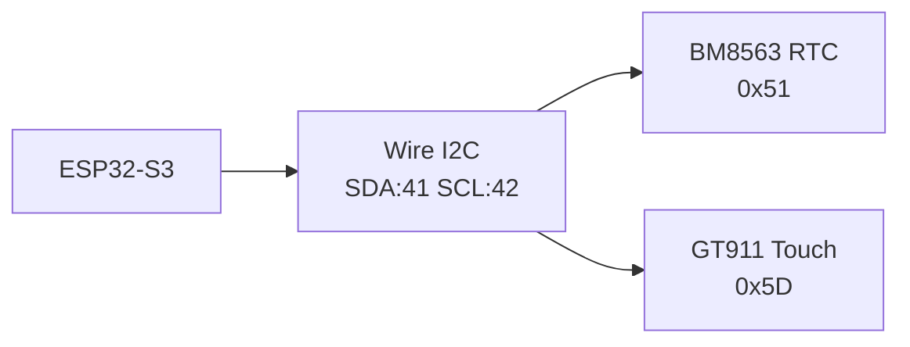

# Known Issues and Workarounds

This document lists known limitations, quirks, and their workarounds in the M5Paper S3 Fossibot Dashboard project.

## 1. RTC Accessibility (SOLVED)

### Issue

The BM8563 RTC was not accessible when reconfiguring the I2C bus for the GT911 touch controller using M5Unified defaults.

### Solution (Implemented)

Both the BM8563 RTC and GT911 Touch Controller share the same external I2C bus on the M5Paper S3: **SDA=41, SCL=42**.

1. **Single I2C Bus**: Configured `Wire` on GPIO 41 and 42 for both devices.
2. **Direct Driver**: M5Unified's RTC driver is incompatible with this manual Wire configuration. A direct hardware driver (`src/hardware/rtc.h`) was created to communicate with the BM8563 at address `0x51`.

### Technical Details



**Implementation:**

- `Wire.begin(41, 42)` in `main.cpp`
- Custom `RTC::` namespace functions in `rtc.h` for getting/setting time
- M5.Rtc is bypassed entirely

---

## 2. Device Battery Returns -2%

### Issue

`M5.Power.getBatteryLevel()` returns -2% on M5Paper S3.

### Cause

M5Unified's power driver may not be fully configured for M5Paper S3, which uses a different power management IC than other M5Stack devices.

### Workaround

Battery percentage display has been removed from the UI.

### Future Solution

Read battery voltage directly via ADC and calculate percentage:

```cpp
// hypothetical - needs pin verification
int rawADC = analogRead(BATTERY_ADC_PIN);
float voltage = (rawADC / 4095.0) * 3.3 * 2;  // Assuming voltage divider
float percent = map(voltage, 3.0, 4.2, 0, 100);  // LiPo voltage range
```

---

## 3. Touch Coordinate Transformation

### Issue

GT911 reports coordinates in portrait mode (540×960), but the display is used in landscape (960×540).

### Solution

Coordinates are transformed in `readTouchManual()`:

```cpp
// Raw: X = 0-540 (short axis), Y = 0-960 (long axis)
// Screen: X = 0-960 (horizontal), Y = 0-540 (vertical)

int screen_x = raw_y;         // Panel Y → Screen X
int screen_y = 540 - raw_x;   // Invert Panel X → Screen Y
```

### Visual Explanation

```
       Touch Panel (Portrait)          Screen (Landscape)
       ┌─────────────────┐            ┌────────────────────────┐
       │     raw_y=0     │            │                        │
       │                 │            │ screen_x=0      =960   │
       │ raw_x=0    =540 │    →→→     │ screen_y=0             │
       │                 │            │                        │
       │    raw_y=960    │            │         =540           │
       └─────────────────┘            └────────────────────────┘
```

---

## 4. BLE CRC Byte Order

### Issue

The Fossibot protocol expects CRC bytes in **high-byte first** order, which is opposite to standard Modbus RTU (which uses little-endian).

### Symptoms

- Commands are silently ignored
- No response from Fossibot
- Works for read but not write commands

### Correct Implementation

```cpp
// WRONG (standard Modbus RTU)
command[6] = crc & 0xFF;         // Low byte first
command[7] = (crc >> 8) & 0xFF;  // High byte second

// CORRECT (Fossibot protocol)
command[6] = (crc >> 8) & 0xFF;  // High byte first
command[7] = crc & 0xFF;         // Low byte second
```

---

## 5. E-Ink Refresh Ghosting

### Issue

Previous screen content may remain visible (ghosting) after partial updates.

### Solution

- Use full screen clear before major redraws
- Use high contrast (black on white)
- Periodic full refresh

```cpp
// Full clear
M5.Display.fillScreen(TFT_WHITE);
M5.Display.display();
```

---

## 6. Touch INT Pin Not Used

### Issue

The GT911 interrupt pin (GPIO 36) is not used for touch detection.

### Reason

The INT pin behavior was unreliable in testing. Polling mode provides consistent results.

### Implementation

Touch is polled every 100ms in the main loop:

```cpp
static unsigned long lastTouchPoll = 0;
if (millis() - lastTouchPoll > 100) {
    lastTouchPoll = millis();
    
    int tx, ty;
    if (readTouchManual(&tx, &ty)) {
        uiManager->handleTouch(tx, ty, TouchEvent::PRESS);
    }
}
```

### Tradeoff

- ✅ More reliable detection
- ❌ Slightly higher CPU usage
- ❌ Touch latency up to 100ms

---

## 7. BLE Connection Drops

### Issue

BLE connection may drop during extended use.

### Mitigation

- Auto-reconnect on disconnect
- Connection status displayed in header
- Periodic connection health check

```cpp
void FossibotBLE::update() {
    if (!isConnected()) {
        attemptReconnect();
        return;
    }
    // ... normal operation
}
```

---

## Summary Table

| Issue | Severity | Status | Workaround |
|-------|----------|--------|------------|
| RTC not accessible | High | Fixed | Custom Direct Driver |
| Battery % returns -2 | Medium | Implemented | Removed from UI |
| Touch coordinate swap | Low | Fixed | Transformation applied |
| CRC byte order | High | Fixed | High-byte first |
| E-Ink ghosting | Low | Partial | Periodic full refresh |
| Touch INT unused | Low | Accepted | Polling mode |
| BLE drops | Medium | Implemented | Auto-reconnect |

---

## Contributing

If you find a solution to any of these issues, please submit a pull request or open an issue!

## See Also

- [Hardware Guide](hardware-guide.md) - I2C details
- [BLE Protocol](ble-protocol.md) - CRC calculation
- [UI Architecture](ui-architecture.md) - Touch handling
