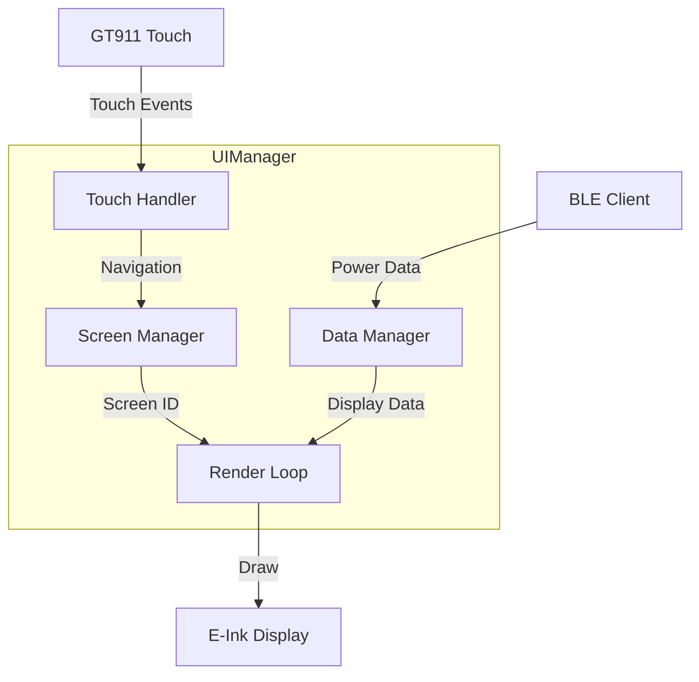
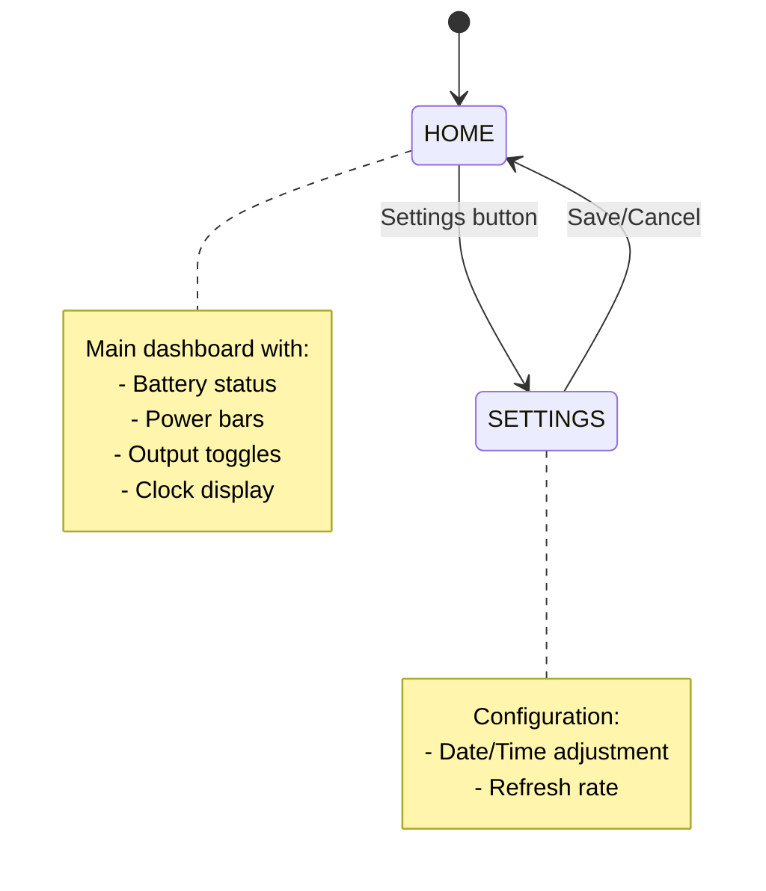
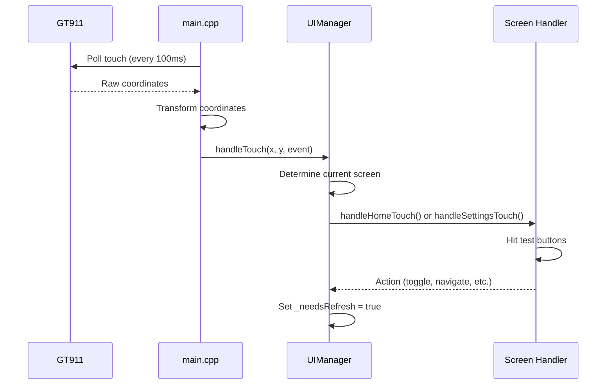
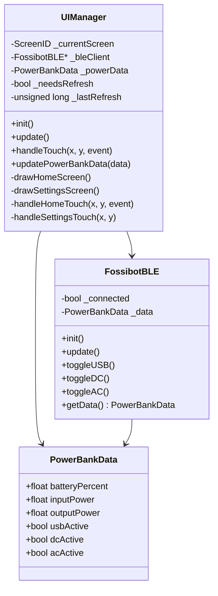

# UI Architecture Guide

This guide documents the user interface architecture, screen navigation, touch handling, and rendering system.

## Overview

The UI is managed by the `UIManager` class which handles:

- Screen state and navigation
- Touch event processing
- Screen rendering with E-Ink optimization
- Data display and refresh timing



## Screen Navigation



### Screen IDs

```cpp
enum class ScreenID {
    HOME = 0,
    SETTINGS = 1,
    // Future screens
    DETAILED = 2,
    GRAPH = 3,
    INFO = 4
};
```

## Home Screen Layout

```
┌─────────────────────────────────────────────────────────────────┐
│                        HEADER BAR (50px)                        │
│  "Fossibot Dashboard"                                           │
├─────────────────────────────────────────────────────────────────┤
│                                                                 │
│  ┌─────────────────────────┐  ┌─────────────────────────────┐  │
│  │    BATTERY PANEL        │  │    CLOCK PANEL              │  │
│  │                         │  │                             │  │
│  │         56%             │  │      11:30                  │  │
│  │    ████████░░░░         │  │    Thu 9 Jan 2026           │  │
│  │                         │  │                             │  │
│  └─────────────────────────┘  └─────────────────────────────┘  │
│                                                                 │
│  ┌─────────────────────────┐  ┌─────────────────────────────┐  │
│  │    INPUT PANEL          │  │    OUTPUT PANEL             │  │
│  │                         │  │                             │  │
│  │  AC: ████░░░░ 450W      │  │  Total: 128W                │  │
│  │  DC: ██░░░░░░ 200W      │  │                             │  │
│  │  Total: 650W            │  │  [USB] [DC] [AC]            │  │
│  │                         │  │   ●     ●    ○   (toggles)  │  │
│  └─────────────────────────┘  └─────────────────────────────┘  │
│                                                                 │
├─────────────────────────────────────────────────────────────────┤
│ [Home] [Settings] [Clock] [Calc] [Reader] [Games]   MENU BAR   │
└─────────────────────────────────────────────────────────────────┘
```

### Layout Constants

```cpp
// Screen dimensions
static const int SCREEN_WIDTH = 960;
static const int SCREEN_HEIGHT = 540;

// UI regions
static const int HEADER_HEIGHT = 50;
static const int MENU_BAR_HEIGHT = 50;
static const int CONTENT_Y = HEADER_HEIGHT;
static const int CONTENT_HEIGHT = SCREEN_HEIGHT - HEADER_HEIGHT - MENU_BAR_HEIGHT;

// Panel dimensions
static const int PANEL_SPACING = 10;
static const int LEFT_COLUMN_WIDTH = 480;
static const int RIGHT_COLUMN_WIDTH = 460;
```

## Touch Handling

### Event Flow



### Coordinate Transformation

The GT911 reports coordinates in portrait mode, but the display is landscape:

```cpp
// Transform from GT911 to screen coordinates
int screen_x = raw_y;         // Panel Y → Screen X  
int screen_y = 540 - raw_x;   // Invert Panel X → Screen Y

// Clamp to screen bounds
screen_x = constrain(screen_x, 0, 960);
screen_y = constrain(screen_y, 0, 540);
```

### Touch Events

```cpp
enum class TouchEvent {
    PRESS,    // Finger down
    RELEASE,  // Finger up (triggers action)
    DRAG      // Finger moving
};
```

Actions are triggered on `RELEASE` to allow for visual feedback and prevent accidental taps.

### Hit Testing

```cpp
bool isHit(int x, int y, int bx, int by, int bw, int bh) {
    return (x >= bx && x <= bx + bw && y >= by && y <= by + bh);
}

// Example: Settings button hit test
if (isHit(touchX, touchY, 160, 490, 160, 50)) {
    navigateTo(ScreenID::SETTINGS);
}
```

## Toggle Buttons

### Layout

```
┌─────────────────────────────────────────────┐
│          OUTPUT PANEL                       │
│                                             │
│     USB         DC          AC              │
│    ┌───┐      ┌───┐       ┌───┐            │
│    │ ● │      │ ● │       │ ○ │            │
│    └───┘      └───┘       └───┘            │
│   (active)   (active)   (inactive)         │
│                                             │
│   Hit zone includes text + indicator box    │
└─────────────────────────────────────────────┘
```

### Touch Zone Definition

```cpp
// Toggle button dimensions
int toggleX = panelX + 20;
int toggleY = panelY + 80;
int toggleW = 140;  // Width per toggle
int toggleH = 110;  // Height (text + indicator + margin)
int toggleSpacing = (panelWidth - 40) / 3;

// Hit zones
if (isHit(touchX, touchY, toggleX, toggleY, toggleW, toggleH)) {
    _bleClient->toggleUSB();
}
```

## Settings Screen

### Layout

```
┌─────────────────────────────────────────────────────────────────┐
│                        SETTINGS                                 │
├─────────────────────────────────────────────────────────────────┤
│                                                                 │
│   Date:   [-] 2026 [+]   [-] 01 [+]   [-] 09 [+]               │
│                                                                 │
│   Time:   [-] 11 [+]  :  [-] 30 [+]                            │
│                                                                 │
│   Refresh Rate:   [-5]  30 seconds  [+5]                       │
│                                                                 │
│                                                                 │
│            [    SAVE    ]     [   CANCEL   ]                   │
│                                                                 │
└─────────────────────────────────────────────────────────────────┘
```

### Value Adjustment

```cpp
// Example: Year increment
if (isHit(touchX, touchY, 280, 120, 70, 60)) {
    _editYear++;
    if (_editYear > 2099) _editYear = 2020;
}

// Refresh rate adjustment
if (isHit(touchX, touchY, 200, 320, 80, 60)) {
    _refreshRateSeconds -= 5;
    if (_refreshRateSeconds < 5) _refreshRateSeconds = 5;  // Min 5s
}
if (isHit(touchX, touchY, 420, 320, 80, 60)) {
    _refreshRateSeconds += 5;
    if (_refreshRateSeconds > 300) _refreshRateSeconds = 300;  // Max 5min
}
```

## Refresh Management

### E-Ink Optimization

E-Ink displays are slow to refresh, so updates are rate-limited:

```cpp
void UIManager::update() {
    if (!_needsRefresh) return;
    
    unsigned long now = millis();
    
    // Rate limit refreshes (except first refresh)
    if (_lastRefresh != 0 && now - _lastRefresh < (_refreshRateSeconds * 1000)) {
        return;
    }
    
    // Draw current screen
    switch (_currentScreen) {
        case ScreenID::HOME: drawHomeScreen(); break;
        case ScreenID::SETTINGS: drawSettingsScreen(); break;
    }
    
    // Force E-Ink update
    M5.Display.display();
    
    _lastRefresh = now;
    _needsRefresh = false;
}
```

### Forcing Immediate Refresh

For user actions (button presses), bypass the rate limiter:

```cpp
// In touch handler
_needsRefresh = true;
_lastRefresh = 0;  // Force immediate refresh
```

## Software Time System

Since the RTC is inaccessible (see [Known Issues](known-issues.md)), time is tracked in software:

```cpp
// Base time (set in Settings)
int _baseYear = 2026;
int _baseMonth = 1;
int _baseDay = 9;
int _baseHour = 11;
int _baseMinute = 0;
int _baseSecond = 0;
unsigned long _timeSetMillis = 0;  // When time was set

// Calculate current time
unsigned long elapsed = millis() - _timeSetMillis;
unsigned long elapsedSeconds = elapsed / 1000;

int currentSecond = _baseSecond + elapsedSeconds;
int currentMinute = _baseMinute + (currentSecond / 60);
int currentHour = _baseHour + (currentMinute / 60);
// ... handle day/month/year overflow
```

## Drawing Functions

### Progress Bar

```cpp
void drawProgressBar(int x, int y, int w, int h, float percent, bool thick) {
    // Border
    M5.Display.drawRect(x, y, w, h, COLOR_BLACK);
    
    // Fill
    int fillWidth = (int)(w * percent);
    M5.Display.fillRect(x + 2, y + 2, fillWidth - 4, h - 4, COLOR_DARK_GRAY);
}
```

### Toggle Indicator

```cpp
void drawToggle(int x, int y, const char* label, bool active) {
    // Label
    M5.Display.setTextSize(3);
    M5.Display.setCursor(x, y);
    M5.Display.print(label);
    
    // Indicator box
    int boxY = y + 40;
    M5.Display.drawRect(x, boxY, 30, 30, COLOR_BLACK);
    
    // Fill if active
    if (active) {
        M5.Display.fillRect(x + 4, boxY + 4, 22, 22, COLOR_BLACK);
    }
}
```

## Class Diagram



## See Also

- [Hardware Guide](hardware-guide.md) - Touch controller details
- [BLE Protocol](ble-protocol.md) - Data source for display
- [Known Issues](known-issues.md) - Limitations and workarounds
